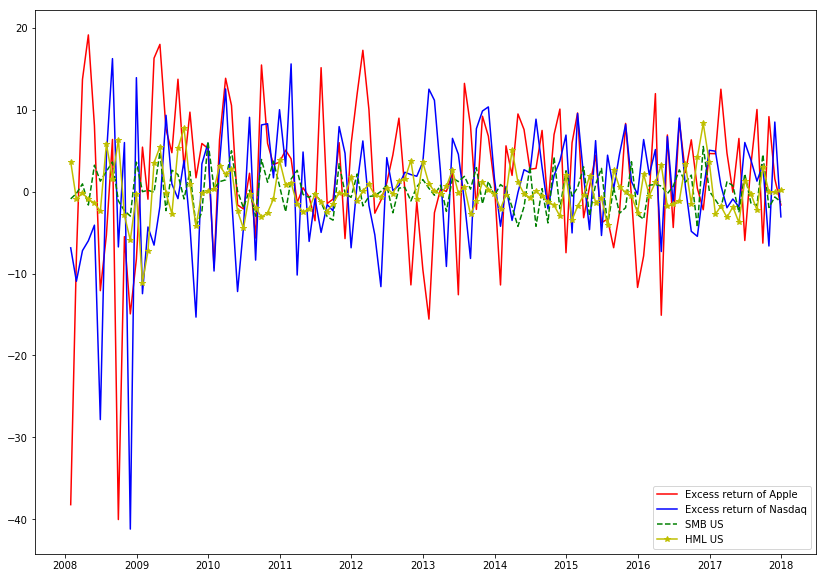

# financials
My Notes on AZEK's excellent CFDS Course. 

1) Have your Quandl key exported
```$ export QUANDL_KEY="your quandl key"```

2) Have your python 3 environment ready.

```$ pip install -r requirements.txt```

```$ jupyter lab```

3) Open ```Hoepner_Exercises.ipynb``` to see the exercises life in action!

```$ echo have fun```

### Apple described in a Fama/French 3-Factor Model
